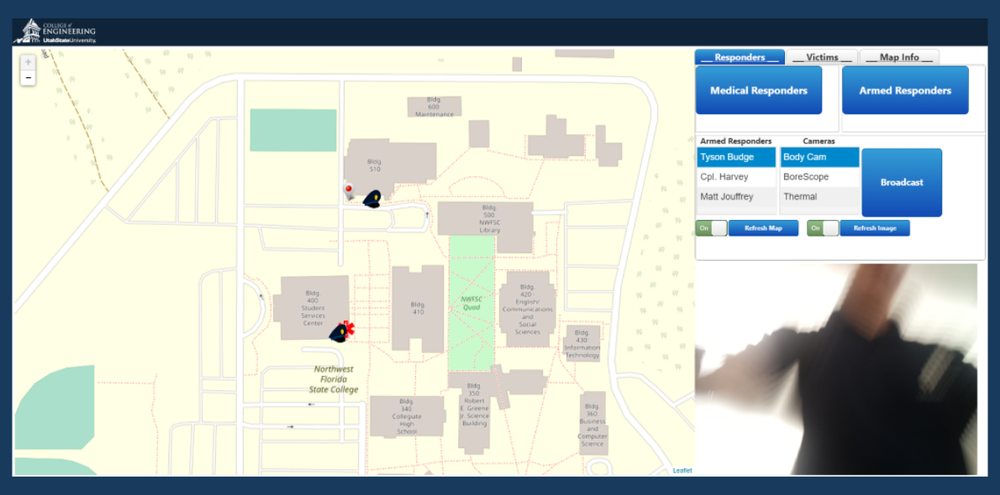
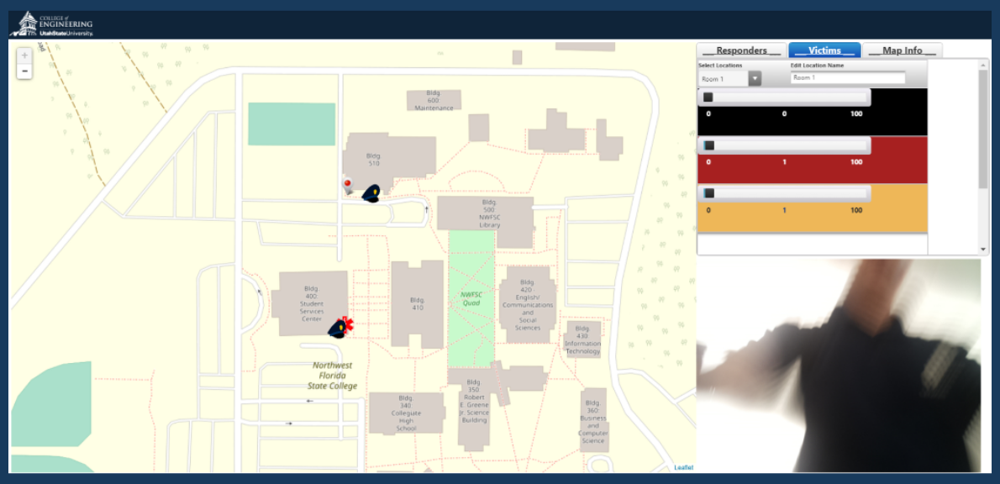
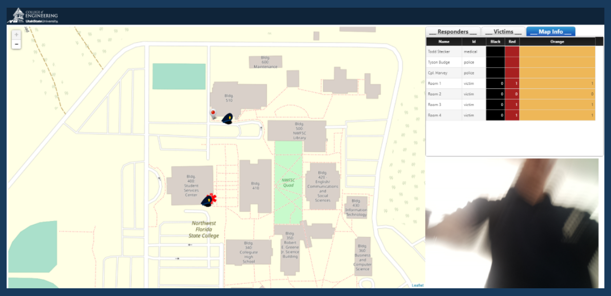
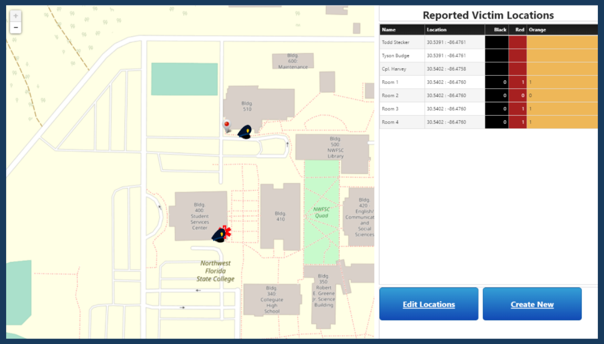
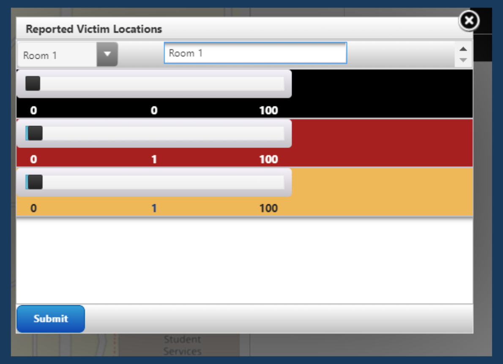
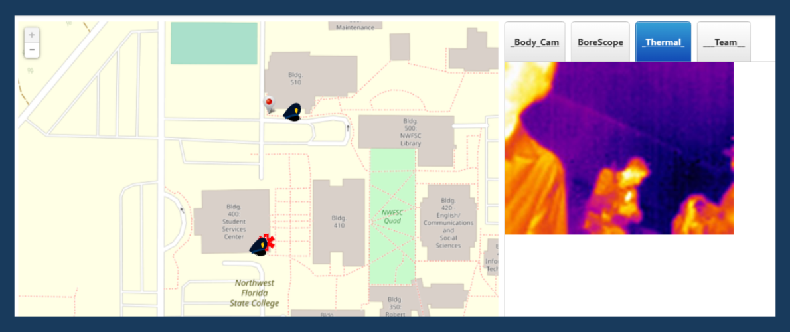

# Integrated Projects

## Mobile Active Threat Emergency System (MATES)

The MATES project was developed as a submission to the Air Force Research Lab's University Design Competition in 2019. I competed in the competition for my Mechanical Engineering senior design project at Utah State University. In rapidly developing emergencies, such as active shooters, natural disasters, or building collapses, the largest loss of life occurs due to miscommunication between first responders. After interviewing EMTs, police officers, enlisted military, and emergency response managers I implemented a proof of concept solution to better enable emergency response. My team developed an Internet of Things (IoT) application, with ThingWorx, that connects all first responders with one another in real time.

Our proof of concept application connected three types of emergency responders: leadership, armed, and medical. Each group received a web-based app customized for their duties during an experiment. We designed the system to optimize the appropriate amount of data sharing between the responders in an easy to digest delivery. I worked on the entire IoT platform, which included the GUI design, data sharing, and edge device integration. You can read further details of the project in the following [report](images/mates/mates_report.pdf) and [presentation](images/mates/mates_presentation.pdf).

This video shows a beta demonstration of the system several weeks before the competition. It goes through each of the GUIs detailed below and does a small demonstration of the armed responder. Several improvements occurred between this video and the presentation. They include streaming the video instead of sending screen shots at 1 fps. The other main improvement fixed the flashing and reset errors on the leadership screen when the data refreshes.

### Emergency Response Leadership (Central Command)

Emergency leadership attempts to direct response efforts and resources during emergencies. Their biggest difficulty is understanding the nature and extent of a dynamic emergency despite misinformation and information overload. To enable their response, I developed a GUI that shows leadership a map of the emergency area with pins representing responders and victims. It also allows leadership to update victim counts as the situation evolves, view the personal information of the responders on scene, view live body camera footage, and broadcast it to the team.

  

  

  

  

### Medical Responders

The medical first responders survey the emergency area to locate and number the victims. When they find a victim, they detail the triage count of the victims in the area and an optional description. The app then creates a pin at the GPS coordinates of the responder and updates the emergency map to central command. This easy to use system was designed to quickly update data and help central command send medical responders to high victim areas.

  
  

### Armed Responders

For active threat emergencies, such as an armed threat, armed responders search the scene to eliminate the threat. Accordingly, their app requires no data entry and only shows information. We discussed this screen in detail with a Corporal in the Marine Corps, a SWAT instructor, and a Chief of Police. With their feedback, I developed a GUI that shows a map of the area on one side, and a video stream on the other. 

The operator can select the desired stream from one of four sources: body camera, thermal camera, bore scope, and team stream. The body camera stream enables operators to place their body camera in hallways or around corners to watch the area remotely, or without exposing themselves to danger. The thermal camera enables responders to find heat signatures and locate hidden threats or victims. The bore scope is a camera on the end of a wire that enables the responders to view under doorways or around corners before exposing themselves to danger. The final stream, team stream, comes from leadership and shows one of the camera feeds from another operator. It would be useful to identify a shooter or other item of interest.

  

