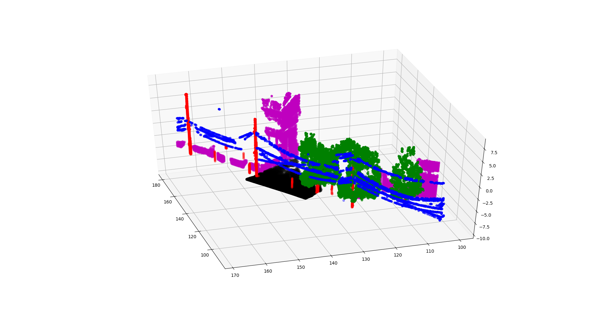
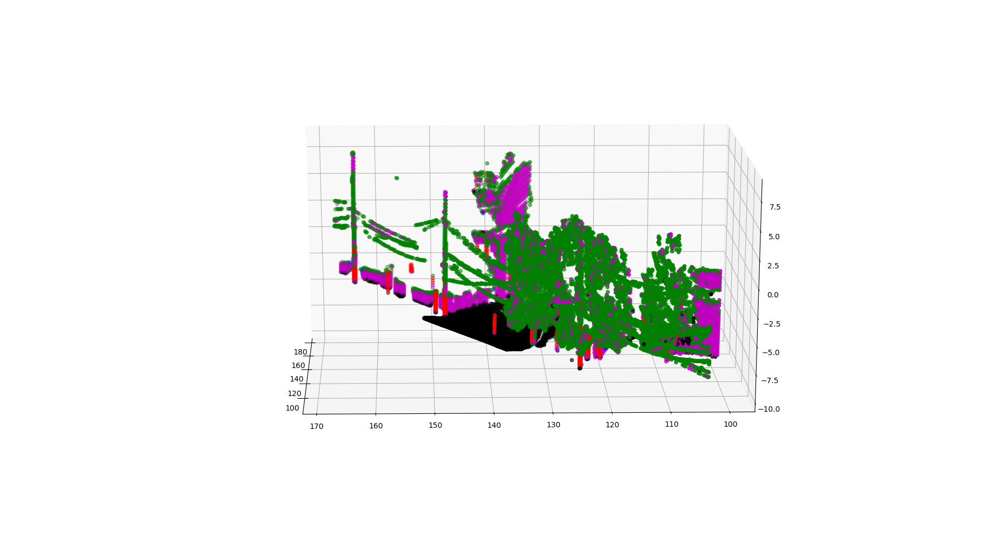
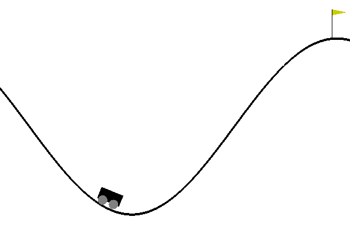

# Machine Learning Projects

[Return Home](/../../)

## Stock Market Prediction

In my free time, I play around with machine learning applied to the stock market. While I currently don't use my work to seriously invest, I do enjoy applying my knowledge to predicting such complicated data. I first worked on this project in an Intelligent Systems course at Utah STate University. My initial efforts explored the effects of several hyperparameters on training shallow networks on predicting Apple stock. You can read my report for the project [here](images/stocks/stocks_report.pdf).

Since starting this project for the class, I have expanded it in several ways. I worked out a simulator to evaluate a trading algorithm for some period of time on historical stock data. I've also implemented wrapper classes with several models (SVM, KNN, Decision Trees, etc.) and constructed a majority vote system. I'm currently working on this project and am beginning to expand to neural networks.

## Evolving Optimal Hyperparameters: Tune hyperparameters using a genetic algorithm

Most, if not all, people who have worked in machine learning or controls knows the frustrating process of tuning hyperparameters. Considerable time is spent worrying if there is a bug in your code, or if you simply have not found a functional set of hyperparameters yet. The naive approach is to sample all pairs of parameters, but this becomes untractable in higher dimensions and only works in discontinuous space. To solve this problem, I helped develop a task agnostic hyperparameter optimizer using genetic algorithms. I worked on this project with Shaun Ryer and Stefan Zhu. The final report and presentation can be found here:

[Report](images/robostats/hyperparameterTuning_FinalReport.pdf) and [Presentation](images/robostats/hyperparameterTuning_FinalPresentation.pdf)

Our algorithm works with continuous and discrete values, categorical parameters, and logarithmic parameters. All values are normalized [0,1] within the optimizer. The user can select between several sampling methods to create the initial smaple population. Each sample is evaluated in the test environment and ranked in performance. The top subset of parameter sets are used to reproduce the next generation. This process is repeated as desired, or until convergence. In addition to a standard genetic algorthim, we employ a form of evaluation relaxation by using a shallow neural network to approximate the hyperparameter-reward state. Do a dense search through the neural network after each population evaluation. The top performers of the approximated hyperparameter space are injected into the top performers in the true hyperparameter space to simulate a type of "invasive species". This method helps the algorithm explore out of local optima. Further details and results can be found in the report.

## Reinforcement Learning for a Robotic Arm

For the Robot Autonomy course at Carnegie Mellon, I worked on teaching a robotic arm to place groceries in a cupboard using reinforcement learning. The project was originally intended to be realized on a physical arm, but restrictions to the COVID-19 pandemic caused us to move to a simulated environment. We used RLBench and V-Rep to simulate the arm. You can find the code for this project in my git repository [here](https://github.com/eichmeierbr/robo_autonomy_project).

This project focused on solving one of the major problems of facilitating machine learning in the real world: resetting the environment. When training in simulation, a "reset" call is made at the end of a training episode to return the environment to the original state. In the real world, there is no such "reset" call. In reality, the "reset" function is done by a research assistant who manual restores the original environment state. This method is slow and expensive. In a team of 3, I explored the possibility of programming a robot to reset the environment itself to facilitate full-time unsupervised training. This video shows the resetting portion of the task for performing the forward task manually.

My teammates worked on the resetting task, which involved removing objects from the cupboard and standing up objects that were knocked down. I worked on the learning task which involved using reinforcement learning to grasp, and place the objects in the cupboard. I used the [TensorForce](https://tensorforce.readthedocs.io/en/latest/) library to implement a Deep Q-Network. I separated the grasp task and the place task to learn the respective behaviors independently. For each task, I reduced the state space and action space as much as possible to speed up convergence due to the tight schedule of the project. I also did bounds checking on the action space to protect the robot within the environment and prohibit impossible joint configurations.

  
  

The report and presentation my teammates and I made for this project can by found here:

[Report](images/grocery_rl/Autonomy_Report.pdf)

[Presentation](https://docs.google.com/presentation/d/1j3ABuQvJndEL6WjDsbPbcUgUFTWPosp4RI9eBwghe20/edit?usp=sharing)

## Statistical Techniques in Robotics (RoboStats) - Carnegie Mellon University

This course explored the application of machine learning algorithms to real world, changing environments. I learned about algorithms that learn online and the implications of such algorithms to deploying an untrained agent into the environment. To better understand the performance of learning algorithms, I learned about the expected optimal performance and variance of an array of algorithms and problems against stochastic and adversarial environments. The hyperparameter learning project detailed above was performed for the final project in this class.

### **Prediction with Expert Advice (Weighted Majority Vote)**

In this project I analyzed the expected performance of the weighted majority vote (WMA) and random weighted majority vote (RWMA) algorithms against constant, stochastic, and adversarial environments. To analyze the algorithms in a fun, but only slightly realistic environment, I created a set of rules to determine in the CMU football team would win a game. The assumptions were that the CMU players played well at home, in rainy conditions, and when less than half the team had an exam in the week leading up to the game. In the deterministic environment, the Tartans won if two of these three conditions are met. I then created a set of experts to predict the games based on the three key indicators, a pessimistic fan who predicts all losses, an optimistic fan who predicts all wins, and a fan that alternates between wins and losses.

### **Online Supervised Learning**

This project used an SVM to classify points from a lidar point cloud. The data came from an autonomous vehicle driving through Pittsburgh and contained 5 classes: Vegetation, Wire, Pole, Ground, Façade. I implemented a soft-margin SVM as the classifier for this dataset. A challenge with this problem is the wire and pole classes and drastically fewer points compared to the other classes. Despite this, the SVM I implemented acheived 92% accuracy in classifying the points. The following images show the true data labels and predicted labels on a dataset excluded from training.

| True | Predicted |
| :---: | :---: |
|  |  |

### **Multi-Armed Bandits**

Multi-Armed Bandits is a problem type where an agent must act between a set of actions, or allocate resources, in such a way to maximize reward. It is inspired by gambling in a casino where an individual must find the most profitable slot machine. In this project I implemented the UCB and EXP3 algorithms and compared their effectiveness in stochastic and adversarial environments. The UCB algorithm is designed to be optimal in stochastic environments whereas the EXP3 algorithm performs better against and adversary.

### **Other Topics**

In addition to the concepts discussed above, the course covered a wide array of other topics and algorithms:

* Basic convex optimization
* Follow the regularized leader
* Boosting
* Reinforcement Learning
* Policy Gradients: Model-based + Model-free
* Off-policy RL
* Model-based RL
* Imitation Learning
* Generative Adversarial Networks (GANs)
* Variational Autoencoders (VAEs)

## Introduction to Machine Learning - Carnegie Mellon University

In my first semester at CMU I took the graduate level course Introduction to Machine Learning. The course surveyed a wide variety of ML topics, and I was required to implement several from scratch. Beyond the algorithms themselves, I learned the importance of understanding the inductive bias inherent within learning models. Due to the nature of the material I do not have many images of my work, and cannot directly share my code due to academic integrity concerns, but here is a list of concepts that I implemented, or with which I am familiar.

### Algorithms I implemented with their application

**1) Decision Trees**

In the first project for the course I implemented a decision tree to predict US politician party affiliation using a subset of voting history. I implemented the learning mechanism using ID3, which splits the tree using the highest mutual information at each level. 

**2) Logistic Regression**

In this project I implemented a single class logistic regression model to analyze sentiment in movie reviews. To do so, I create a dictionary from each word the training data. Each word in the dictionary acts as an input into the model. I train the model by passing pre-labeled  movie review lines through the model and optimizing with gradient descent. 

**3) Neural Networks**

Similar to a project in my perception experience, I created a fully connected neural network algorithm to analyze hand written letters. I created a framework to create an arbitrarily deep network with a user-determined number of nodes in each layer that used sigmoid activation functions. 

**4) Reinforcement Learning**

In this project I created a Q-Learning model to learn to play a simple "Mountain Car" game. In the game, the car is at the bottom of a valley. The state space is the cart's postition and velocity. The action space is to move left, move right, or do nothing. The problem is that the car does not have enough power to directly move up the hill, so it must learn to rock back and forth and use momentum to reach the top. To find the optimal action, the q-learning model learns a single layer linear function to approximate the reward function for each individual action as a function of the input space. It then passes the cart space through the three models and selects the highest value. I also included a random element to introduce state space exploration vs. exploitation. 

**5) Hidden Markov Models and the Viterbi Algorithm**

I implemented a system to estimate the  emission, transition, and prior values of a system for an HMM. I also implemented the viterbi algorithm to find the most likely sequence of hidden states for a system. I validated the algorithm on a data set that reads in sentences, and predicts the part of speech for each word. However, due to the nature of HMMs, the algorithm I implemented could readily be applied to any data setting assuming the training data is presented in a similar manner.

### Other Concepts of Familiarity

* K Nearest Neighbors
* Perceptron
* Linear Regression
* Feature Engineering
* Regularization
* Generative vs. Discriminative models
* Maximum Likelihood Estimation (MLE) vs. Maximum A Posteriori (MAP)
* Naive Bayes
* Support Vector Machines
* Principle Component Analysis and Dimensionality Reduction
* Ensemble Methods and Adaboost
* Information Theory

[Return Home](/../../)
