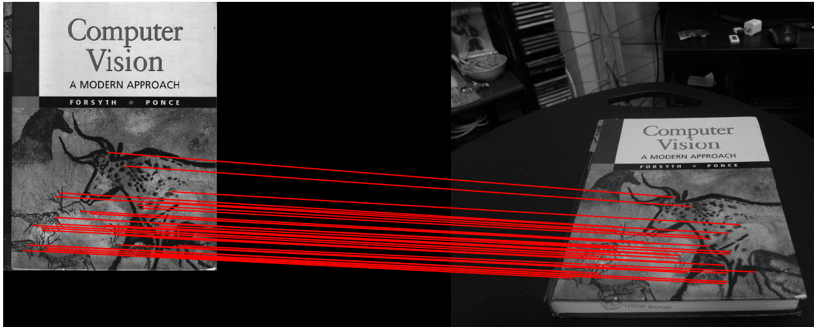

# Perception

## Computer Vision Assignments

### Bag of Words - Scene Recognition using Filter Banks

This project uses a classical approach to scene recognition. The first step uses different filters (guassion, derivative of gaussian, etc.) at different scales to create a bank of filtered images. 

 

Then, a feature vector is created by creating a “pipe” of a random subset of pixels through all of the images. Using a sample of these feature vectors from the training images, I used a K-means cluster to define a number of different visual wors within the images. The next four pairs of images show a visual word representation of an aquarium, kitchen, waterfall, and desert respectively. 

  
   

  
   

  
   

  
   

After computing the words in an image, I use a spatial pyramid to create a histogram of the frequency of words occurring at different locations in the image. I then compare the spatial histogram to the histogram representation of each image in the training data and assign the class of the scene to the most similar histogram. This approach to scene recognition reached about a 65% accuracy when selecting between eight classes.

### Homography: Panoramas and Augmented Reality

This project used classical feature detection and matching to create a homography between a template image and a scene. I used the FAST feature detector and the BRIEF feature descriptor to locate and correlate features between two images.

Using these correspondences, I found the homography between both images using the following procedure:

In general, a homography correlates points on two different planes through a linear operation

where

The H matrix is a 3x3 matrix with 8 degrees of freedom. This means we can solve the homography using 4 corresponding point pairs. To make the homography calculation robust, I employ the RANSAC algorithm to mitigate the effect of noise.

After finding the homography between the template book cover and the scene shown in the previous image, I superimpose another book cover into the scene.

  

Using this same homography algorithm, there's two fun applications I implmeented. The frst algorithm is a basic panorama creator. It works by taking two images that have some amount of overlap and match the common features. Then it finds a homography from one image to the other. Improvements could be made to the panorama by bluring the boundaries between the two images. Here is a panorama I made myself using this method. The images were taken on the bridge connecting Newell Simon Hall and Wean Hall at Carnegie Mellon University. The background shows the Cathedral of Learning at the University of Pittsburgh.

  
   

  

The second fun application is a basic augmented reality application. In this program I embed one video inside of another. The main video shows a scene of books, including the template book shown in the feature matching image. The second video is from Kung Fu Panda. For each frame of the book image I locate the template book and replace its area within the frame with a frame from the movie.

  

### Feature Tracking - The Lukas-Kanade Algorithm

In this project I made my own implementation of the Lukas Kanade tracking algorithm. I then made modern improvements to the algorithm using template correction and the inverse composition approach to estimating the template warp between frames. I evaluated the implementation on two different scenes, a car and a girl with a scooter. Both scenes assume the template only changes in position and is constant in size and shape. The red rectangle shows the tracking with template correction; the blue does not have template correction.

  
   

Next, I slightly modified the algorithm to find moving objects within a scene. I did this by using the entire previous frame through the sequence as the template and finding the warp from one frame to the next. Then, I determine the moving objects in the scene by computing if the difference in each pixel between the two images is above a certain threshold. The following two gifs show a scene of moving ants and driving cars respectively. Note the camera in the car sequence is moving throughout the sequence and the algorithm mostly only detects the moving objects in the scene.

  
   

### 3D Reconstruction

This project creates a 3D point cloud from two images of the same object. The following sequence of images reconstructs an ancient temple in 3D using two images taken at a slightly different perspective from the camera. Beyond documenting historical artifacts, 3D reconstruction has extensive application in SLAM/Visual Odometry.

  
   

The first step in this process is finding the correspondances between the two images. For this project I was given the points to create the reconstruction, but they could just as easily be found using a feature matching method similar to the one I used in the homography project. Then I calculate the fundamental matrix using the 8-point algorithm. Given any point in one image, the fundamental finds the epipolar line along with that point resides in the other image. I then scan along that epipolar line to find the corresponding point in the other image.

  

Given the fundamental matrix, the relative camera matrices between the two images can be computed. Using the point correspondances and the relative matrices I performed a least squares error minimiation to find the most likely 3D point for each given correspondance pair. The next image shows the reconstructed temple in 3D.

  

An application of this reconstruction is finding the position of a car in 3D space. To demonstrate this functionality, I received images from the the paper "CarFusion: Combining Point Tracking and Part Detection for Dynamic 3D Reconstruction of Vehicles" by N Dinesh Reddy, Minh Vo, and Srinivasa G. Narasimhan. This paper reconstructs the positions of cars driving through an intersection using three uncalibrated cameras. Using three concurrent images from their work, I find the location of the vehicle in the intersection relative to the first camera. The next image shows the reconstruction from two image trios.

  

