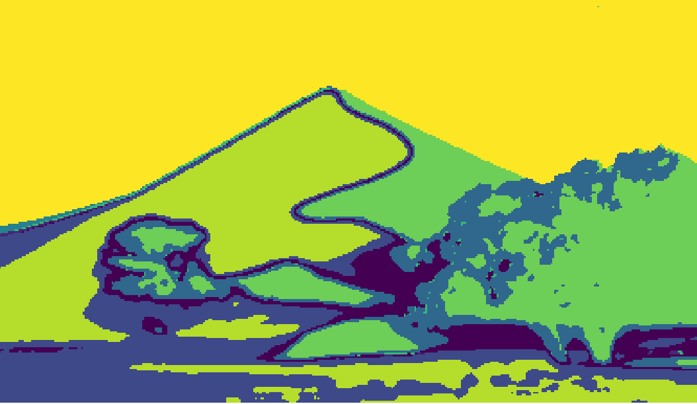

# Perception

## CV Assignments

### Bag of Words - Scene Recognition using Filter Banks

This project uses a classical approach to scene recognition. The first step uses different filters (guassion, derivative of gaussian, etc.) at different scales to create a bank of filtered images. 

 

Then, a feature vector is created by creating a “pipe” of a random subset of pixels through all of the images. Using a sample of these feature vectors from the training images, I used a K-means cluster to define a number of different visual wors within the images. The next four pairs of images show a visual word representation of an aquarium, kitchen, waterfall, and desert respectively. 

  
   

  
   

  
   

  
   

After computing the words in an image, I use a spatial pyramid to create a histogram of the frequency of words occurring at different locations in the image. I then compare the spatial histogram to the histogram representation of each image in the training data and assign the class of the scene to the most similar histogram. This approach to scene recognition reached about a 65% accuracy when selecting between eight classes.

### Homography: Panoramas and Augmented Reality

This project used classical feature detection and matching to create a homography between a template image and a scene. I used the FAST feature detector and the BRIEF feature descriptor to locate and correlate features between two images.

Using these correspondences, I found the homography between both images using the following procedure:

In general, a homography correlates points on two different planes through a linear operation

where

The H matrix is a 3x3 matrix with 8 degrees of freedom. This means we can solve the homography using 4 corresponding point pairs. To make the homography calculation robust, I employ the RANSAC algorithm to mitigate the effect of noise.

After finding the homography between the template book cover and the scene shown in the previous image, I superimpose another book cover into the scene.

  

Using this same homography algorithm, there's two fun applications I implmeented. The frst algorithm is a basic panorama creator. It works by taking two images that have some amount of overlap and match the common features. Then it finds a homography from one image to the other. Improvements could be made to the panorama by bluring the boundaries between the two images. Here is a panorama I made myself using this method. The images were taken on the bridge connecting Newell Simon Hall and Wean Hall at Carnegie Mellon University. The background shows the Cathedral of Learning at the University of Pittsburgh.

  
   

  

The second fun application is a basic augmented reality application. In this program I embed one video inside of another. The main video shows a scene of books, including the template book shown in the feature matching image. The second video is from Kung Fu Panda. For each frame of the book image I locate the template book and replace its area within the frame with a frame from the movie.

  

### Feature Tracking - The Lukas-Kanade Algorithm
