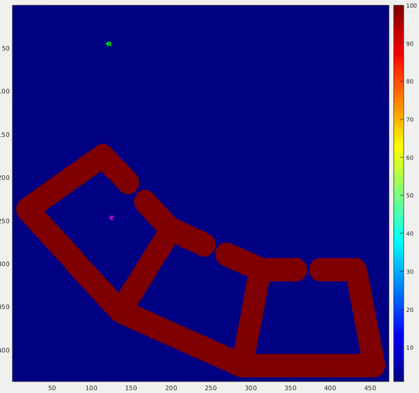
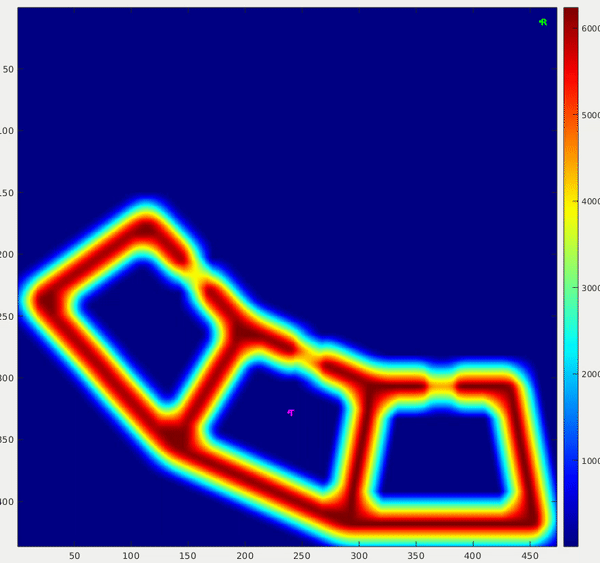
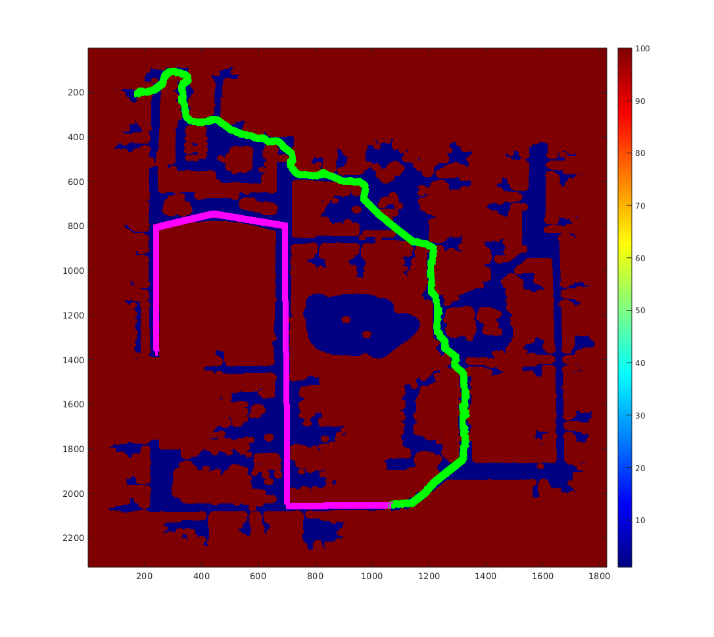
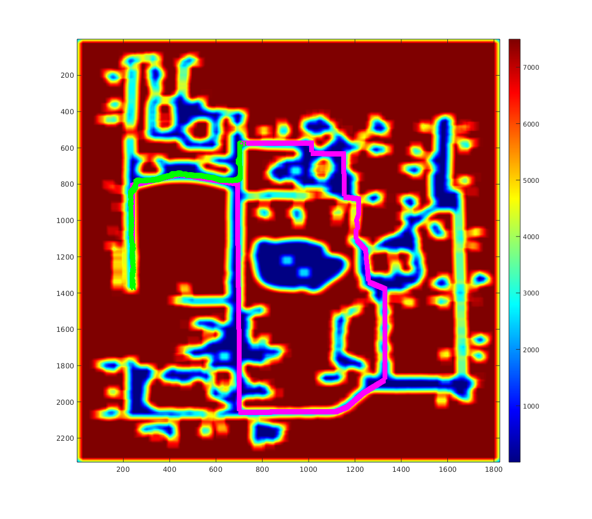
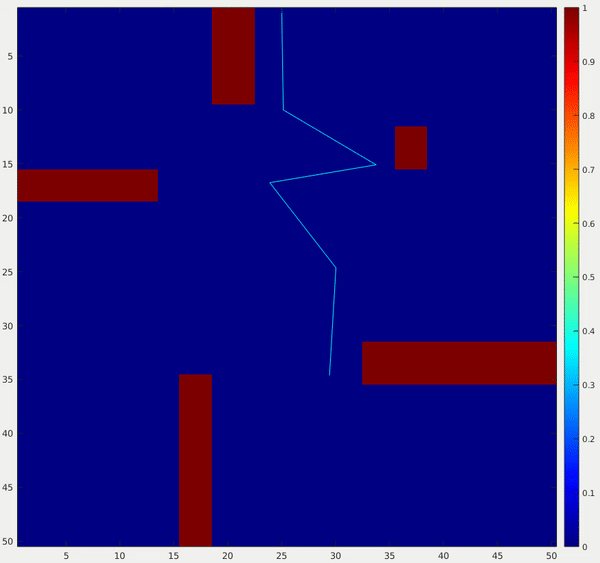
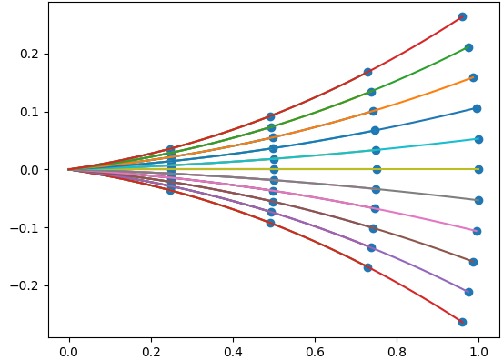
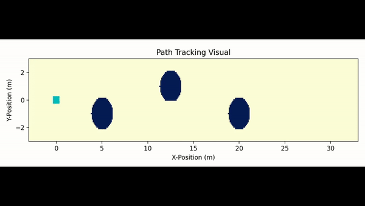

# Planning and Control

[Return Home](/../../)

## Planning and Decision-making in Robotics Assignments - Carnegie Mellon University

The following projects were developed as homework assignments for Dr. Maxim Likhachev's planning course at Carnegie Mellon University in Fall 2020. Due to academic integrity considerations, I can only discuss my work at a surface level. Each project used C++ as the programming language. 

This course taught a wide range of planning algorithms and paradigms:
* A* (Weighted, Backward, Multi-Heuristic, Multi-Goal)
* Anytime Planning
* Incremental Planning
* Sample-Based Planning (RRT, RRT-Connect, RRT*, PRM)
* Symbolic Planning
* Planning Under Uncertainty (Minimax, Expected Cost MDPs, POMDP)

### **Catching a Moving Target**

In this problem, a robot is given perfect knowledge of the environment and future trajectory of a moving target. The environment is discretized as a 2D array. Both the target and the robot are able to move using an 8-connected grid. To solve this problem, I frame the search as a mutli-goal 2.5D search. I then explore the search space using a basic A* search. This method efficiently finds the optimal target interception in most cases. The following videos show the robot catching the target in both uniform and non-uniform cost environments.

  
  

I also tested the planner on a larger environment to test a large search space. The following images show the final plan in the binary and non-binary cost environments.

  
  

### **Planning for an Arm**

In this project I compared the performance of 4 different planning algorithms for a 5 link arm. I implemented the following algorithms from scratch: RRT, RRT*, RRT-Connect, PRM. The provided environment moved through a pregenerated space with simple collision checking, and no self-checking.

| **RRT** | **RRT*** | 
| :---: | :---: |
|  |  |
| **RRT-Connect** | **PRM** | 
|  |  |

### **Symbolic Planning**

This project takes on a different flavor from the previous two. In symbolic/task planning, the goal is to move from one world state to another world state. It uses the STRIPS planning paradigm that defines how an agent may interact and change the environment to achieve the goal state. Using this framework, I was able to frame the problem as a graph, and search the graph using A*. Unfortunately there are no pretty visuals for this symbolic environment. The test cases used to validate the algorithm include a block world, and a simulated firefighting task.

### **A* Lattice Search for an Ackermann Vehicle**

This project was the final project for the course, and in conjunction with the [ADAPT MRSD project](https://mrsdprojects.ri.cmu.edu/2020teamb). In the ADAPT project worked to perceive intelligently traverse adverse road conditions (puddles). Bryson Jones, Evan Schindewolf, Shasa Antao, Shaun Liu, and Wesley Wang did a great job in developing the hardware, perception, controls, and overall design of the system. This project focused only on developing the planning subsystem. The following links show the [Report](images/planning_class/ADAP_report.pdf) and [Presentation](images/planning_class/ADAPT_Presentation.pdf) for this project.

I worked with Bryson Jones, Evan Schindewolf, and Shaun Ryer on this project. Within the team, my responsibilities focused on motion primitive generation and node expansion within an A* lattice search. I precomputed a set of motion primitives in python to save online computation time on the final planner. The primitives were fairly simple and assumed a constant steering angle as the vehicle changes from one velocity to another over a fixed time interval. Though some unrealistic assumptions were made in the vehicle dynamics, the planner performed well in both simulation and hardware testing. The first figure shows an example set of motion primitives. The next two figures are testing results in simulation and hardware respectively.

  

  

  

## Quadrotor Dynamic Simulation and Control

I developed this project in coordination with the Aerial Robotics section of the Robot Mobility course at Carnegie Mellon University taught by Nathan Michaels. He provided general skeleton code to facilitate a simulation in Matlab. Given this code, I implemented each component of the software architecture shown in the following image. I developed the system to create a trajectory from a series of waypoints, then execute the commanded trajectory. I implemented a nested loop control scheme with position control in the outer loop and attitude control in the inner loop. For the control methods, I compared the effectiveness of both PD and LQR controllers. Finally, I implemented a linear motor model and dynamics model for the system.

  

I evaluated the system and tuned control parameters by running the simulated drone through several trajectories. The trajectories included hover, step input, line-tracking, bounded z-acceleration, ellipse, and pirouette. You can see the extent of my testing and results in this [report](images/quadrotor/air_report.pdf).

## Autonomous Vehicle Club

I'm adding this project, not because it is particularly well done, but rather becuase it was my first experience in robotics. At Utah State University I participated in the Autonomous Vehicle Club. We had a 1/10 scale RC car retrofitted with an IMU and a lidar. We used this car to participate in the Sparkfun Autonomous Vehicle Competition. I joined the team during my Junior year at USU. In my first year on the team I implemented Google Cartographer to improve our SLAM capability. This is also when I became familiar with Linux and ROS. 

In my second year with the team I helped fix a variety of bugs with the low level velocity controller, helped recruit new team members, and improved the simulation capabilities of the team. In coordination with a Mobile Robotics course taught by Dr. Greg Droge, I created a URDF representation of the vehicle. I then took a simple go-to-goal controller provided by Dr. Droge and implemented a bicycle model vehicle to represent the car. You can see the result of that work in this [repository](https://github.com/eichmeierbr/avc_urdf). This video shows my first attempts into vehicular robotics.

[Return Home](/../../)
