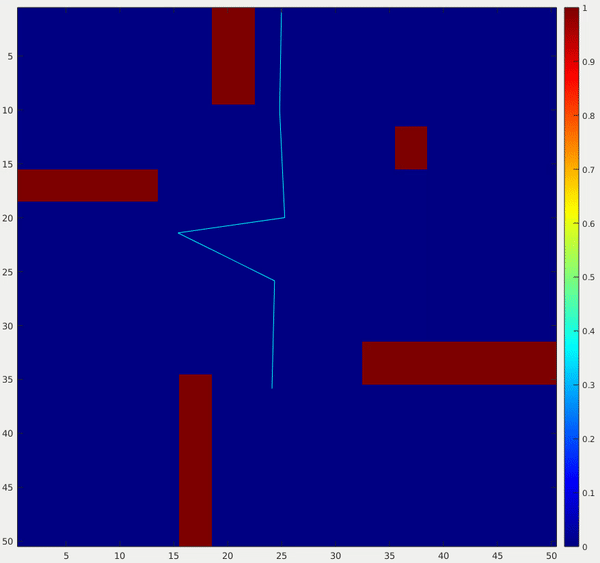

# Planning and Control

[Return Home](/../../)

## Robot Localization and Mapping

Simultaneous Localization and Mapping (SLAM) is one of my favorite topics within robotics. It is a widely applicable field that combines the perception and planning/controls functionality of a robotic system. The following projects took place under the guidance of Dr. Michael Kaess in Carnegie Mellon's Robot Localization and Mapping course (16-833).

### Final Project - Online Estimation of Sensor Error

Both optimization and filter based SLAM approaches require some initial estimate of the uncertainty for each data source. In many settings these can be accurately defined with prior testing. However, there are many cases in the wild that could derail an effective SLAM algorithm. For my end of term class project I worked on a research type project to estimate the relative uncertainty of several data sources in real time. The project should promising results for improving the [results](./images/slam/SLAM_Final_Report.pdf) of a baseline SLAM algorithm and detecting unreliability in sensors throughout a simulation environment. In my freetime I extend this project using the KAIST Urban Driving and KITTI datasets.

<object data="./images/slam/SLAM_Final_Report.pdf" type="application/pdf" width="700px" height="700px">
    <embed src="./images/slam/SLAM_Final_Report.pdf">
        
This browser does not support PDFs. Please download the PDF to view it: <a href="./images/slam/SLAM_Final_Report.pdf">Download PDF</a>.

    </embed>
</object>

### Dense SLAM with Point-Based Fusion

This project uses an RGB-D camera to reconstruct a 3D representation of a living room. In dense SLAM, the algorithm attempts to represent the entire state space from sparse data. Here, the ICP algorithm is used to align nearby data scans. Then, a weighted filter is used to calculate an optimal value for the color for each surface aligned from the ICP. 

  

  

### Linear and Non-Linear Pose Graph Optimization

Graph-based SLAM produces the robot's pose over time using a linear optimization scheme. The problem is formulated to optimize the pose by minimizing the error between received sensor measurements, modeled measurements if the sequences of poses is correct. In this project the sensor returned non-linear measurements (angle and range) between the robot and a set of landmarks. I formatted these into a linear system to run the linear optimizer. These images show the the trajectory and landmark estimates before and after optimization.

  
  

### EKF-SLAM

The Kalman Filter is the optimal estimator for linear system. It marginalizes all previous data into state and uncertainty matrices. This approach stands as the base of many filtering based algorithms and is widely used as a low computation pose estimator (ideal for aerospace applications). An Extended Kalman Filter (EKF) approximates non-linear systems using a jacobian matrix. The following image shows a predicted robot path with ellipses representing the robot and landmark uncertainties. For the robot pose, the magenta and blue ellipses represent the uncertainty after the prediction step and update steps respectively. The red ellipses represent the initial landmark uncertainty, and the green ellipses show the updated landmark uncertainty estimates.

  

### Monte-Carlo Localization

Monte-Carlo Localization uses a "survival of the fittest" approach for localizing a robot within a known map. The approach initializes a set of particles within the map (or a selected range if a prior is given). Then, algorithm computes the similarity between the received sensor measurements and "true" measurements if the particle is in the correct location. The particles are resampled from the population based on their probability of occuring at the current pose. After the particles are resampled, noise is added to the perceived motion to probabilistically move the particles towards the true position.

This project uses MCL on a dataset collected from Wean Hall at Carnegie Mellon University. I sampled the motion model for the robot, simulated raycasting for "true" lidar data, and optimized the algorithm to run in real time. The implementation was done in python and vectorized using numpy. This is my favorite example of the five datasets I was given. I like how you can clearly see the algorithm converge on two populations that are in similar hallway conditions. After some time the algorithm shows clear convergence to a seemingly optimal solution.

  

## Planning and Decision-making in Robotics Assignments - Carnegie Mellon University

The following projects were developed as homework assignments for Dr. Maxim Likhachev's planning course at Carnegie Mellon University in Fall 2020. Due to academic integrity considerations, I can only discuss my work at a surface level. Each project used C++ as the programming language. 

This course taught a wide range of planning algorithms and paradigms:
* A* (Weighted, Backward, Multi-Heuristic, Multi-Goal)
* Anytime Planning
* Incremental Planning
* Sample-Based Planning (RRT, RRT-Connect, RRT*, PRM)
* Symbolic Planning
* Planning Under Uncertainty (Minimax, Expected Cost MDPs, POMDP)

### **Catching a Moving Target**

In this problem, a robot is given perfect knowledge of the environment and future trajectory of a moving target. The environment is discretized as a 2D array. Both the target and the robot are able to move using an 8-connected grid. To solve this problem, I frame the search as a mutli-goal 2.5D search. I then explore the search space using a basic A* search. This method efficiently finds the optimal target interception in most cases. The following videos show the robot catching the target in both uniform and non-uniform cost environments.

  
  

I also tested the planner on a larger environment to test a large search space. The following images show the final plan in the binary and non-binary cost environments.

  
  

### **Planning for an Arm**

In this project I compared the performance of 4 different planning algorithms for a 5 link arm. I implemented the following algorithms from scratch: RRT, RRT*, RRT-Connect, PRM. The provided environment moved through a pregenerated space with simple collision checking, and no self-checking.

| **RRT** | **RRT*** | 
| :---: | :---: |
|  |  |
| **RRT-Connect** | **PRM** | 
|  |  |

### **Symbolic Planning**

This project takes on a different flavor from the previous two. In symbolic/task planning, the goal is to move from one world state to another world state. It uses the STRIPS planning paradigm that defines how an agent may interact and change the environment to achieve the goal state. Using this framework, I was able to frame the problem as a graph, and search the graph using A*. Unfortunately there are no pretty visuals for this symbolic environment. The test cases used to validate the algorithm include a block world, and a simulated firefighting task.

### **A* Lattice Search for an Ackermann Vehicle**

This project was the final project for the course, and in conjunction with the [ADAPT MRSD project](https://mrsdprojects.ri.cmu.edu/2020teamb). In the ADAPT project worked to perceive intelligently traverse adverse road conditions (puddles). Bryson Jones, Evan Schindewolf, Shasa Antao, Shaun Liu, and Wesley Wang did a great job in developing the hardware, perception, controls, and overall design of the system. This project focused only on developing the planning subsystem. The following links show the [Report](images/planning_class/ADAPT_Report.pdf) and [Presentation](images/planning_class/ADAPT_Presentation.pdf) for this project.

I worked with Bryson Jones, Evan Schindewolf, and Shaun Ryer on this project. Within the team, my responsibilities focused on motion primitive generation and node expansion within an A* lattice search. I precomputed a set of motion primitives in python to save online computation time on the final planner. The primitives were fairly simple and assumed a constant steering angle as the vehicle changes from one velocity to another over a fixed time interval. Though some unrealistic assumptions were made in the vehicle dynamics, the planner performed well in both simulation and hardware testing. The first figure shows an example set of motion primitives. The next two figures are testing results in simulation and hardware respectively.

  

  

  

## Quadrotor Dynamic Simulation and Control

I developed this project in coordination with the Aerial Robotics section of the Robot Mobility course at Carnegie Mellon University taught by Nathan Michaels. He provided general skeleton code to facilitate a simulation in Matlab. Given this code, I implemented each component of the software architecture shown in the following image. I developed the system to create a trajectory from a series of waypoints, then execute the commanded trajectory. I implemented a nested loop control scheme with position control in the outer loop and attitude control in the inner loop. For the control methods, I compared the effectiveness of both PD and LQR controllers. Finally, I implemented a linear motor model and dynamics model for the system.

  

I evaluated the system and tuned control parameters by running the simulated drone through several trajectories. The trajectories included hover, step input, line-tracking, bounded z-acceleration, ellipse, and pirouette. You can see the extent of my testing and results in this [report](images/quadrotor/air_report.pdf).

## Autonomous Vehicle Club

I'm adding this project, not because it is particularly well done, but rather becuase it was my first experience in robotics. At Utah State University I participated in the Autonomous Vehicle Club. We had a 1/10 scale RC car retrofitted with an IMU and a lidar. We used this car to participate in the Sparkfun Autonomous Vehicle Competition. I joined the team during my Junior year at USU. In my first year on the team I implemented Google Cartographer to improve our SLAM capability. This is also when I became familiar with Linux and ROS. 

In my second year with the team I helped fix a variety of bugs with the low level velocity controller, helped recruit new team members, and improved the simulation capabilities of the team. In coordination with a Mobile Robotics course taught by Dr. Greg Droge, I created a URDF representation of the vehicle. I then took a simple go-to-goal controller provided by Dr. Droge and implemented a bicycle model vehicle to represent the car. You can see the result of that work in this [repository](https://github.com/eichmeierbr/avc_urdf). This video shows my first attempts into vehicular robotics.

[Return Home](/../../)
