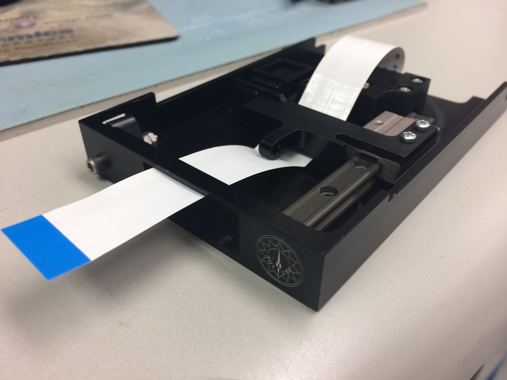
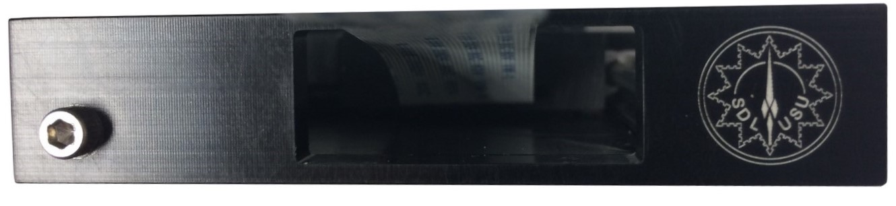

# Work Experience

## Space Dynamics Lab

### Mechanical Engineering Intern: Summer 2017

After my Sophomre . The device mounts the screen to a custom hinge. This hinge connects to a miniature linear slide rail that extends the screen from the housing to a viewing position. When housed, a touch latch connects to the hinge to secure the screen from unintended deployment. I designed the system to use two separate sets of electronics: the primary screen and the secondary data relay. This two-stage electronics setup allows users to access the screen without compromising security to the rest of the server. Additional design considerations include EMI protection, secure mounting, and practical machinability.

  

  

