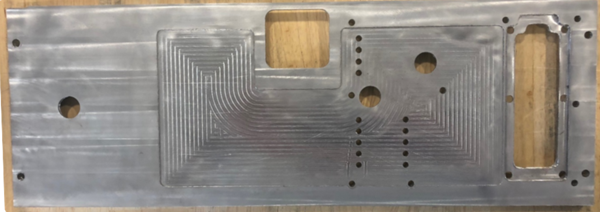

# Work Experience

[Return Home](/../../)

## Ten One Aerospace

### Sr Software Engineer: June 2025 - Current

## Hill Air Force Base

### Software Engineer: June 2021 - June 2025

I had a fantastic start to my professional career as a civilian employee of the United States Air Force. The Air Force provided many unique technical challenges and opportunity for growth. My first year and a half focused on embedded simulation development for the F-16. Then, I had a 6 month fellowship in machine learning research with MIT and the MIT Lincoln Laboratory. Finally, I worked two years on the internal research and development team for emerging technologies that focused on big data applications. On this team I rose from individual contributor to technical program manager, which role was more accurately described as a staff engineer. You can find a more thorough description of this time here: [309 Software Engineering Group](./309sweg.md).

## ProtoInnovations

### Research Consultant: Spring 2021

During my final semester at Carnegie Mellon, I was asked by a professor to work as a research consultant in his startup ProtoInnovations. ProtoInnovations performs design, analysis, and testing for the mobility subsystem of planetary rovers. I researched a novel process called "risk-driven design". In this paradigm, I helped formulate a framework that attempt to prioritize development efforts and reduce mission risk. The process generally functioned by identifying sources of uncertainty (both in the mission and rover design), estimating the amount of reducible (epistemic) uncertainty, and prioritizing efforts to reduce that uncertainty.

## Autonomous Solutions Inc.

### Guidance, Navigation, and Control (GN&C) Intern: Summer 2020

Over the summer of 2020 I was fortunate to receive an internship during the COVID-19 pandemic. Due to the circumstances, I worked remotely from my apartment in Pittsburgh. At ASI, I was asked to perform a wide array of tasks related to implementing a custom end to end visual odometry system. The front end of the pipeline I developed processed data from a special sensor and published the data as a ROS topic. Using the data I created a type of "image" where I could perform feature detection and tracking. Finally, the tracked features were used to predict the motion of the sensor. To aid in testing the pipeline I implemented a low-fidelity and a mid-fidelity simulation environment. By the end of summer I had all modules individually working in simulation and hardware. Unfortunately I was unable to harden the system to test the full system on live hardware before the summer ended.

  

## Utah Power Electronics Lab

### Undergraduate Research Assistant: Fall 2017 - Spring 2019

I worked at the Utah Power Electronics Lab (UPEL) during my final two years at Utah State. During my first year I was the only mechanical engineer, student or otherwise, in the lab. My job largely involved supporting the research efforts of the graduate electrical engineering students by create mounts, testing fixtures, etc. Besides the lab manager, I was also the primary 3D printer and CNC machinist. The main skills I learned include practical design, project management, interdisciplinary teamwork, CNC machining, and thermal design/analysis.

#### Project 1: The BLAST Lab

One of the primary research areas at UPEL focuses on advanced battery technologies. My first major project involved retrofitting a concrete jet engine testing cell to facilitate our battery testing. For my efforts, I was allowed to name the new lab as the BLAST Lab. Since its completion, the BLAST Lab has been used to test various research batteries, batteries for EP Systems, and a battery for the NASA X-57 aircraft. 

  

Updating the facilities included several electrical upgrades. I designed, machined, and installed several pass-through panels to transmit sensor data from the testing cell to the observation area. 

  
  

I also designed two mobile testing stands. One stand serves as the testing platform and mount to one of the filters. The other stand carries the other primary filter. Finally, when lithium ion batteries enter thermal runaway, they emit toxic fumes. I designed the ducting and building modifications to enable our filters to remove these fumes.

  
  

#### Project 2: AMPED

From January to October in 2018 I designed an advanced battery pack for an external customer. The battery pack houses 24 battery cells that perform active balancing to reduce damage and improve efficiency. The pack balances the cells using circuitry designed by UPEL. I designed the pack casing to accommodate battery chemistries from two common electric automobiles.

  

I designed the first prototype of the exterior casing and machined many of the components using a 3-axis CNC mill. Two of the more complex of these pieces includes the power board heat sink and the front plate, both of which are shown below. A major challenge in the heat sink design was designing such small pads to interface directly with heat generating components.

  

  

  

In addition to the structural design, I also designed the thermal system for the pack. A design feature for the pack required the inside of the pack be waterproof. In consideration of this requirement, I designed a two-stage convective cooling system to remove the heat from the power boards without exposing the electrical components to ambient air.

  

## Space Dynamics Lab

### Mechanical Engineering Intern: Summer 2017

After my Sophomore year I worked at SDL to mount a custom screen into a 2.5" server drive bay. The device mounts the screen to a custom hinge, which connects to a miniature linear slide rail mounted inside the drive bay. The slide extends the screen from the housing to a viewing position. When housed, a touch latch connects to the hinge to secure the screen from unintended deployment. I designed the system to use two separate sets of electronics: the primary screen and the secondary data relay. This two-stage electronics setup allows users to access the screen without compromising security to the rest of the server. Additional design considerations include EMI protection, secure mounting, and practical machinability.

  

  

[Return Home](/../../)
